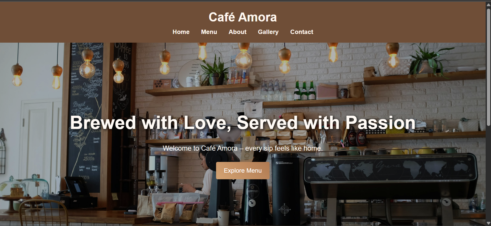

# ☕ Cafe Amora – Frontend Website

> A responsive multi-page café website built as a 1st semester project — 
> featuring clean UI design, image gallery, and live deployment on GitHub Pages.
> 
🔗 **Live Demo:** [Visit Cafe Amora](https://laibaazeem3250-ship-it.github.io/cafe-amora-frontend/)

---


## 📸 Screenshots



---

## ✨ Features

| Feature | Status |
|---------|--------|
| Multi-page Website | ✅ |
| Responsive Design | ✅ |
| Image Gallery | ✅ |
| Contact Page | ✅ |
| Live Deployment | ✅ |

---

## 🛠️ Tech Stack


---

## 📁 Project Structure
cafe-amora-frontend/
├── index.html        ← Home page
├── about.html        ← About page
├── menu.html         ← Menu page
├── gallery.html      ← Gallery page
├── contact.html      ← Contact page
├── css/
│   └── style.css     ← All styling
├── js/
│   └── 1st.js        ← Interactivity
└── images/           ← All assets

---

---

## 🚀 How to View Locally

1. Clone the repo:
```bash
   git clone https://github.com/laibaazeem3250-ship-it/cafe-amora-frontend.git
```
2. Open `index.html` in your browser
3. Or just visit the **live demo** link above! ☝️

---

## 📅 Project Info

| Detail | Info |
|--------|------|
| Semester | 1st Semester |
| Status | ✅ Completed |
| Type | Frontend Only |
| Deployed | GitHub Pages |

---

## 🙋‍♀️ Author

**Laiba Azeem**
🎓 CS Student | Frontend & Java Developer
*Building real projects from semester 1* 💪

[](https://github.com/laibaazeem3250-ship-it)
[](https://laibaazeem3250-ship-it.github.io/cafe-amora-frontend/)
